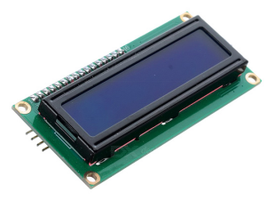
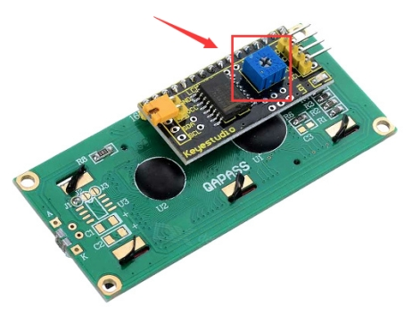
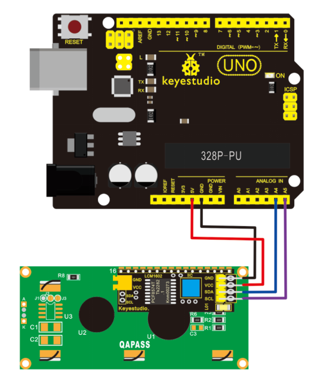
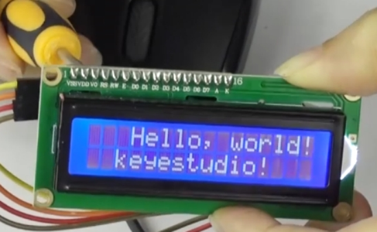
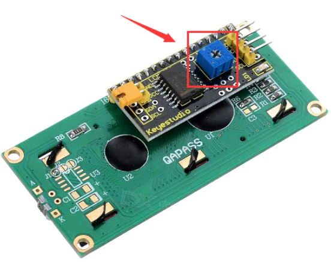

# KS0061 keyestudio 1602 I2C Module



## 1. Introduction

keyestudio 1602 I2C module is a 16 character by 2 line LCD display with Blue background and White backlight.

The original 1602 LCD needs 7 IO ports to be up and running, but ours is built with Arduino IIC/I2C interface, saving you 5 IO ports.

This LCD is ready-to-use because it is compatible with the Arduino Liquid Crystal Library.

LCDs are great for printing data and showing values. Adding an LCD to your project will make it super portable and allow you to integrate up to 32 characters (16x2) of information.

On the back of LCD display there is a blue potentiometer. You can turn the potentiometer to adjust the contrast.

Notice that the screen will get brighter or darker and that the characters become more visible or less visible.



## 2. Specification

- I2C Address:0x27
- Backlight (Blue with white char color)
- Supply voltage: 5V
- Adjustable contrast

## 3. PINOUTS

- GND: A pin that connects to ground
- VCC: A pin that connects to a +5V power supply
- SDA: A pin that connects to analog port A4 for IIC communication
- SCL: A pin that connects to analog port A5 for IIC communication

## 4. Connection Diagram

I602 is equipped with 4 pins in total. SCL should be connected to analog 5, SDA to analog 4, VCC to +5V and GND to ground.

Below is connection diagram for your reference:



## 5. Sample Code

Download  Resources :  [Resources](./Resources.7z)

```c
//Compatible with the Arduino IDE 1.0
//Library version:1.1
#include <Wire.h>
#include <LiquidCrystal_I2C.h>
LiquidCrystal_I2C lcd(0x27,16,2); // set the LCD address to 0x27 for a 16 chars and 2 line display

void setup()
{
    lcd.init(); // initialize the lcd
    lcd.init();
    // Print a message to the LCD.
    lcd.backlight();
    lcd.setCursor(3,0);
    lcd.print("Hello, world!");
    lcd.setCursor(2,1);
    lcd.print("keyestudio!");
}

void loop()
{
}
```

## 6. Result

Hookup well and upload the code to board, you should see the words “ Hello, World!” and “keyestudio” pop up on your LCD.

Remember you can adjust the contrast by turning the potentiometer on the back if you can’t make out the words clearly.



If you have any issues, make sure your code is correct and double-check your connections.

